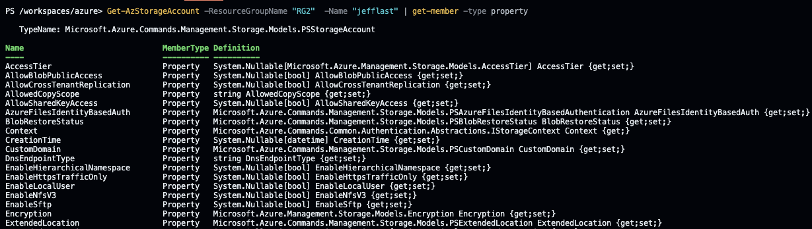
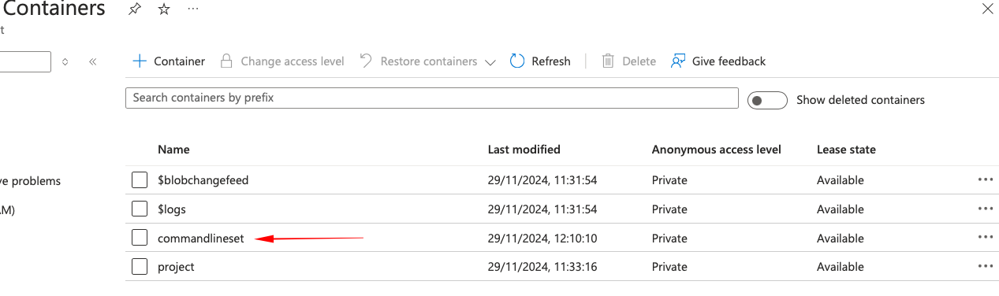
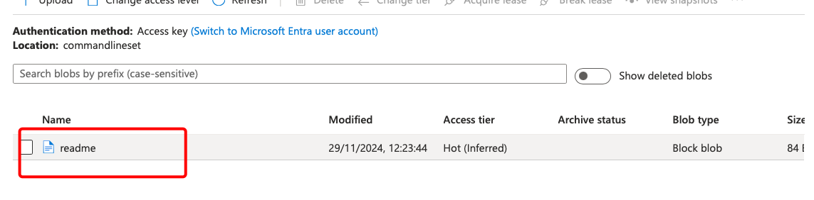

### Purpose of Storage Accounts

Storage accounts provide enterprise cloud storage solutions in a secure environment, managed via the Azure Portal, CLI, or PowerShell, and requiring an Azure subscription.

### When to Use Storage Accounts

- **Consider multiple accounts** for projects, teams, or regions based on:
    - Different data types
    - Accessibility needs
- **Types of Data Stored**:
    - **Blobs**: Binary Large Objects (files)
    - **File Shares**: Shared folders accessible from various OS
    - **Queues**: Message storage for applications
    - **Tables**: NoSQL key-value storage

### Access Management

- **Access Keys**: Provides full access; two keys are issued for key rotation.
- **Shared Access Signatures (SAS)**: Time-limited access to specific resources.
- **RBAC**: Access can be managed through role-based controls.

### Additional Features

- **Encryption**: Supports both Microsoft-managed and customer-managed keys.
- **Geo-Replication**: Provides a backup in a secondary region.
- **Blob Lifecycle Management**: Automates actions based on data age.

## Types of Blobs

1.  **Block Blobs**: For smaller files (documents, images).
2.  **Page Blobs**: For larger files (VHDs) with random read/write access.
3.  **Append Blobs**: For appending data, such as log files.

## Creating a Storage Account

### Steps to Create a Storage Account

1.  **Navigate to Storage Accounts** in the Azure Portal.
2.  **Click Create**:
    - Choose Subscription and Resource Group.
    - Specify a unique Storage Account Name.
    - Set Region, Performance tier, and Redundancy options.
3.  **Set Advanced Options** for Blob Access tier (Hot or Cool).
4.  **Review and Create.**

## Uploading Blobs

### Using the Azure Portal

1.  **Open Storage Account** and go to **Containers**.
2.  **Create a Blob Container**: Click ‘Add Container’ to set preferences.
3.  **Upload Blobs**: Click on the container, then ‘Upload’ to select files.


### Using PowerShell

```pwsh
# List the storage accounts
Get-AzStorageAccount
# To get the details for a specific storage account called jefflast in a resource group named RG2
Get-AzStorageAccount -ResourceGroupName "RG2"  -Name "jefflast"
# sare storage account to a context
$ctx=(Get-AzStorageAccount -ResourceGroupName "RG2"  -Name "jefflast").context

```
#### Getting the propertys of the context
```pwsh
Get-AzStorageAccount -ResourceGroupName "RG2"  -Name "jefflast" | get-member -type property.I

```


#### Create a container for the storage account
```pwsh
New-AzStorageContainer -Name "commandlineset" -Context $ctx 

```


#### Upload blob content usnig powershell
```pwsh
#upload a file named README.md into the commandlineset container
 #we use Set-AzStorageBlobContent 
Set-AzStorageBlobContent  -File "./README.md" -Container "commandlineset" -Blob readme -Context $ctx
```


## Working with az cli

## Overview
This guide covers how to upload blobs to Azure Storage using the Azure Command Line Interface (CLI), specifically through Cloud Shell.

## Key Steps

### 1. List Storage Accounts
```bash
# List all storage accounts (simplified query for names only)
az storage account list --query [].name
```

### 2. Get Storage Account Keys
```bash
# List storage account keys
az storage account keys list \
    --account-name <storage-account-name> \
    --resource-group <resource-group-name> \
    --output table
```

### 3. Set Environment Variables
```bash
# Set storage account name variable
AZURE_STORAGE_ACCOUNT="<storage-account-name>"

# Set storage account access key variable
AZURE_STORAGE_ACCESS_KEY="<access-key>"

# Verify variables
echo $AZURE_STORAGE_ACCOUNT
echo $AZURE_STORAGE_ACCESS_KEY
```

### 4. Create Blob Container
```bash
# Create a new container
az storage container create \
    --name <container-name> \
    --account-name $AZURE_STORAGE_ACCOUNT \
    --account-key $AZURE_STORAGE_ACCESS_KEY
```

### 5. Upload Blob
```bash
# Upload a file as a blob
az storage blob upload \
    --container-name <container-name> \
    --name <blob-name> \
    --file <local-file-path> \
    --account-name $AZURE_STORAGE_ACCOUNT \
    --account-key $AZURE_STORAGE_ACCESS_KEY
```

### 6. List Blobs in Container
```bash
# List blobs in a container
az storage blob list \
    --account-key $AZURE_STORAGE_ACCESS_KEY \
    --account-name $AZURE_STORAGE_ACCOUNT \
    --container-name <container-name> \
    --query [].name
```


