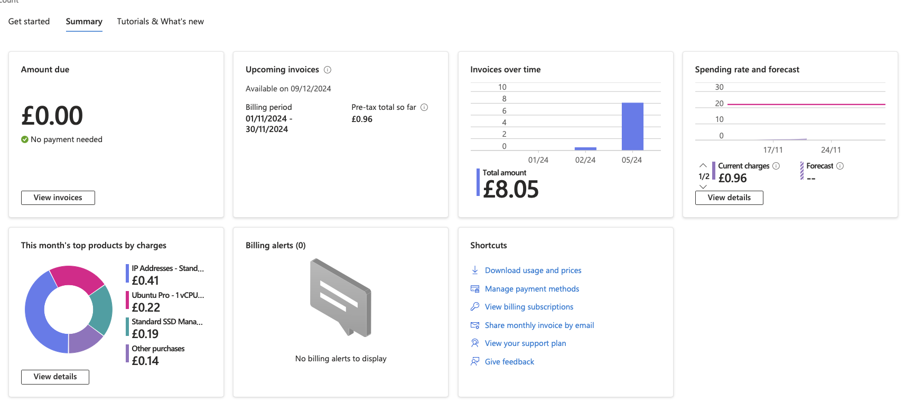
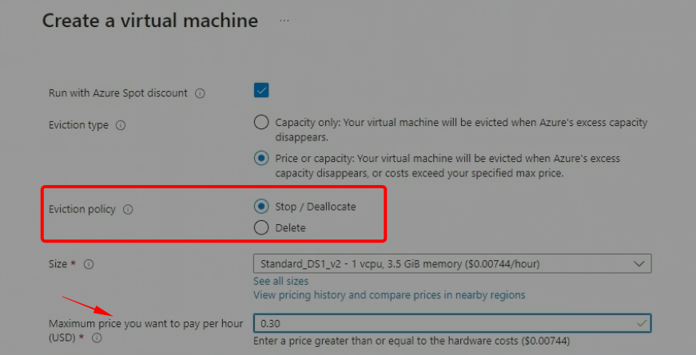
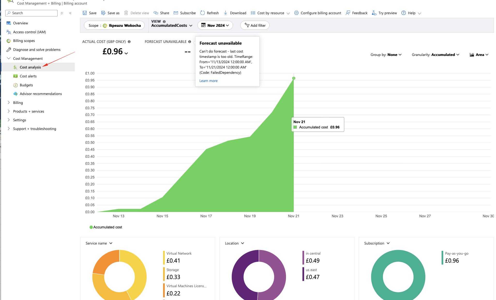
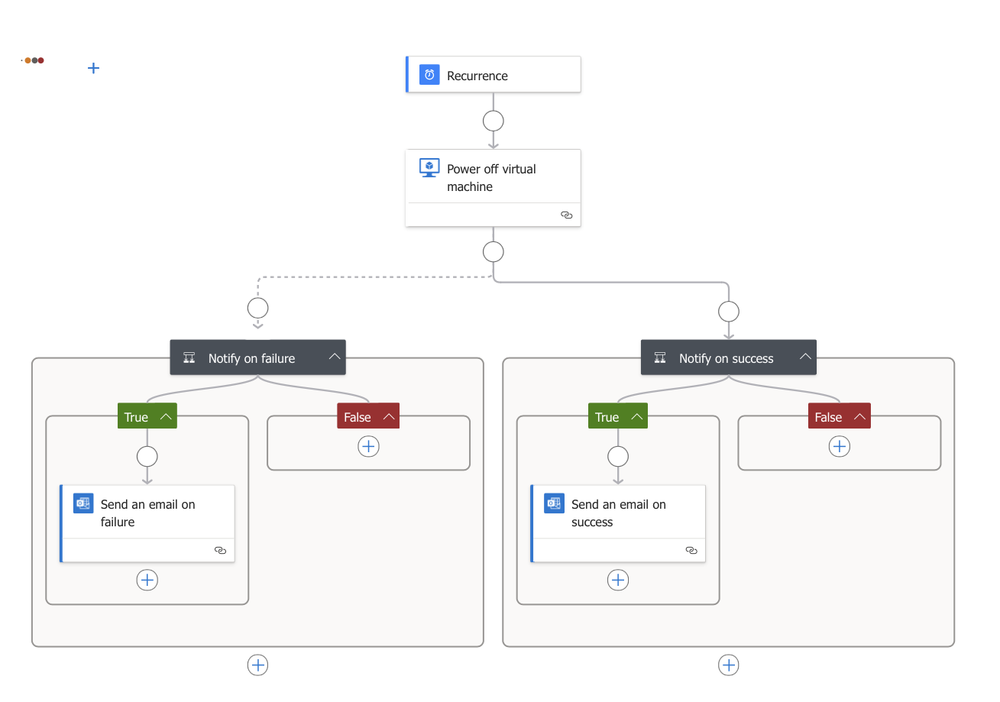
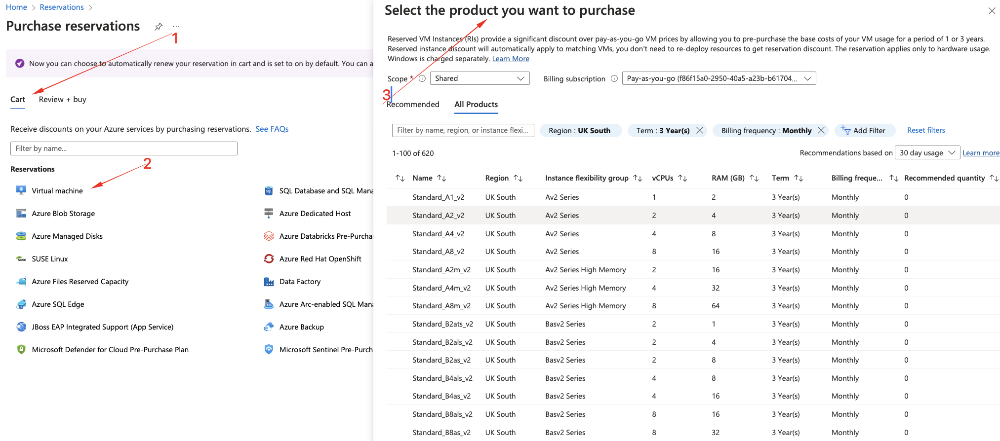
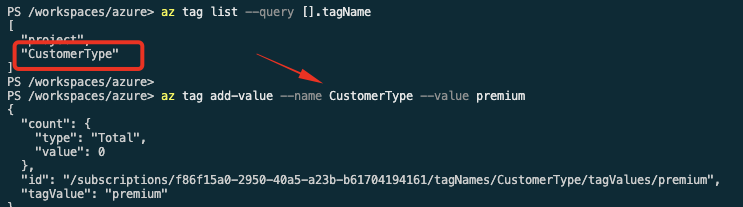
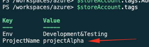

# Azure Cost Management Study Notes

## Overview
This document serves as a comprehensive guide to manage costs effectively in the Microsoft Azure cloud computing environment based on the selected video content. 

## Key Concepts

1. **Azure Subscription Structure**:
   - Costs are associated with Azure subscriptions, which may differ for development, testing, and production environments.
   - Larger organizations might have multiple subscriptions for different business units or geographic regions.
   - Always remember: leaving resources (like VMs) running incurs costs.

2. **Virtual Machine Costs**:
   - VMs are charged by the second, not just by the hour.
   - Costs also accrue for any storage services, databases, and data transfer.



3. **Cost Management Strategies**:
   - **Set Up Cost Budgets**:
     - Use budgets to receive notifications when nearing set monetary limits (e.g., $300/month).
   - **Auto-Shutdown for VMs**:
     - Configure VMs to automatically shut down outside of working hours to avoid unnecessary charges.
   - **Scaling Options**:
     - **Vertical Scaling**: Increasing VM size (more CPUs/RAM), which raises costs.
     - **Horizontal Scaling**: Adding/removing VMs based on demand (autoscaling) is typically more cost-effective.
   - **Reserved Instances**:
     - Commit to long-term usage (1-3 years) for discounts on services like VMs and database instances.
   - **Spot VMs**:
     - Use Spot Virtual Machines for workloads that can handle interruptions, as they provide significant cost savings (up to 90% off normal prices) but with no uptime guarantee.


4. **Using the Pricing Calculator**:
   - Accessible online, allows you to estimate the monthly costs based on expected usage of services. [(price calculator site)](https://azure.microsoft.com/en-us/pricing/calculator/)
   - Detailed service characteristics can be adjusted to see the impact on pricing.
   - Useful for evaluating costs before deploying resources.

5. **Cost Analysis in the Azure Portal**:
   - Utilize the **Cost Analysis** feature to review where expenditures are occurring and adjust accordingly.
   - **Tagging Resources**: Helps categorize and filter expenses related to projects or departments for better visibility and control.

6. **Budgets and Alerts**:
   - Configure budgets to monitor spending and receive alerts via email when you approach thresholds.
   - Alerts can be set up for different conditions (e.g., when costs exceed a certain percentage of the budget).

## Detailed Steps for Implementations

### Setting Up Auto-Shutdown for VMs
1. Navigate to the **Virtual Machines** section in the Azure portal.
2. Select the specific VM you want to configure.
3. Go to **Automation** -> **Tasks (Preview)**.
4. Click on **Add task** and select **Power Off Virtual Machine**.
5. Configure the connection and set the shutdown schedule with notifications.

Note: Auto-shutdown is managed via logic apps under the hood. 
* Auto-startup can also be configures with automation 
<video controls src="autoshutdown.mp4" title="autos shutdown steps"></video>

## image of logic app controlling auto-shutdown



### Configuring Reserved Instances
1. Search for **Reserved VM Instances** in the Azure portal.
2. Select the appropriate VM size and region, then determine the term (1, 3 years).
3. Decide on billing frequency and add to the cart.
4. Consider quantities based on current and future deployments in that region.

Note that reservations can also be managed from the commandline. This requires the powershell reservations module installed.
* install reservations module with:*
```pwsh
   
   install-module az.reservations 
```

### Configuring Reserved Instances for SQL Database
1. steps to find a reserved sql is similar for searching for instance
2. Select the appropriate VMcore size and region, then determine the term (1, 3 years).
3. Decide on billing frequency and add to the cart.
<video controls src="sql-reserved.mp4" title="Search for sql reserved instance"></video>
* Note: It's a good idea to get the estimated cost from the azure cost calculator
You can enter the quantity of database instances you want to pay for during checkout

### Using the Azure Pricing Calculator
1. Access the Azure Pricing Calculator via a browser.
2. Add services to the calculator (e.g., Virtual Machines, Azure SQL Database).
3. Specify detailed characteristics such as region, operating system, and estimated usage.
4. Review the cost estimates generated, adjusting variables as necessary.

### Analyzing Cloud Computing Charges
1. Go to the **Cost Management** section in the Azure portal.
2. Use **Cost Analysis** to filter and view costs by resource, region, or time frame.
3. Ensure resources are organized into resource groups for better management and analysis.

### Tagging Azure Resources
- **Creating Tags**:
  ```bash
  az  tag create --name "CustomerType"
  ```
  **Listing Tags**:
  ```bash 
  az tag list
  To get a specific tag, use --query as shown:
  az tag list --query [].tagName
  ``` 
- **Adding Tags for an existing tage name**:
  

- **Creating Tags with Powershell**:
   ```pwsh

   # The following will get the storoage account details for the storage account
   $storeAccount=Get-AzResource -ResourceName jameslast -ResourceGroupName RG1 
   # The result from the above has a tags attribute that can be used to assign tag values to the resource
   $storeAccount.tags
   # set the tags using the add method
    $storeAccount.tags.Add("ProjectName", "projectAlpha")

   #The resource needs to be updated for the tag to showup in the resource. use following commmand to set tagSet-AzResource -tag $storeAccount.tags -ResourceId $storeAccount.id
   Set-AzResource -tag $storeAccount.tags -ResourceId $storeAccount.id
   ```





- To view tagged resources, you can filter in the **All Resources** view or during budget analysis to identify related costs.
- We can have up to 50 tags per resource
- We can filter resources or group or resources based on assigned tags


### Creating Budgets in Azure
1. Go to the **Subscriptions** section and select your active subscription.
2. Navigate to the **Budgets** section under Cost Management.
3. Click **Add** to configure a new budget:
   - Set the scope (subscription/resource group).
   - Define budget thresholds and notification settings.
   - Choose to notify via email or SMS when approaching budget limits.

### Viewing Invoices
1. Access the **Billing profile invoices** section from your subscription settings.
2. Review current and past invoices, with options to export to CSV or download as PDF for record-keeping.

## Conclusion
Efficient cost management in Azure requires understanding your usage patterns, setting up automated rules, leveraging reserved instances, and utilizing the tools available to monitor and analyze expenditures. Properly configuring budgets and alerts allow for proactive management of cloud computing charges.
