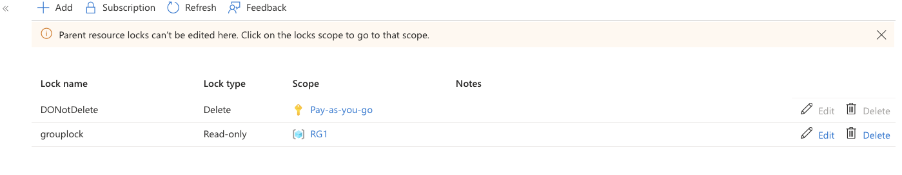
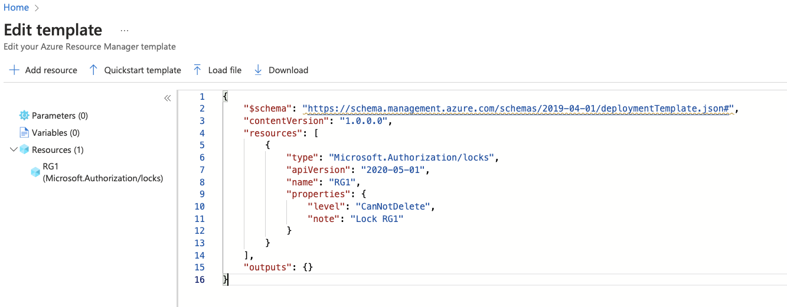

# Study Notes on Azure Resource Locks

## Overview
Azure Resource Locks are a feature designed to protect Azure resources from accidental deletion or modification. They serve as a safety net rather than a security measure. This is to ensure the integrity of azure resources and prevent accidental changes

---

## Types of Resource Locks
There are two main types of resource locks you can implement in Azure:

1. **Read-Only Lock**: Prevents any modification of the resource. Users can still read the resource, but they cannot change its properties.

2. **CanNotDelete Lock**: Prevents the deletion of the resource. Users can still modify and read the resource if they have the necessary permissions but cannot delete it.

### Hierarchical Application of Locks
Locks can be applied at various levels within Azure's hierarchy:

- **Subscription Level**: A lock at this level affects all resources within all resource groups in the subscription.
- **Resource Group Level**: A lock here only affects resources within that specific resource group.
- **Individual Resource Level**: Locks can be applied to specific resources for granular control.

### Lock Inheritance
- **Inheritance Behavior**: Locks set at a higher level (e.g., subscription) will inherit down to resources at lower levels (e.g., resource groups and individual resources).
- **Precedence of Locks**: If there are multiple locks set at various levels, the most restrictive lock takes precedence.

## Control Plane vs. Data Plane
- **Control Plane**: This refers to the management layer for resources. Resource locks apply to actions within this plane (e.g., modifying or deleting a resource).
- **Data Plane**: This is where the actual data resides. Resource locks generally do not affect operations within this layer (e.g., deleting blobs in a storage account), meaning users with permission can still modify data even with a resource lock in place.

---

## Managing Resource Locks

### 1. Using the Azure Portal
To manage resource locks via the Azure portal:
- Navigate to the resource, resource group, or subscription.
- Under **Settings**, select **Resource locks**.
- Use the **Add** button to create a new lock. Choose between **Read-Only** and **CanNotDelete**, provide a name and description, and save.

#### Example Steps:
1. Navigate to the subscription or resource group.
2. Click on **Resource locks**.
3. Use the **Add** option to create a lock.
4. Fill in lock type, name, and optional notes.
5. Save your changes.

### 2. Using Azure CLI
Azure CLI commands for managing resource locks include:
- **Create a Resource Lock**:
    ```bash
    az account lock create --name <LockName> --lock-type <CanNotDelete|ReadOnly>
    ```
- **List Resource Locks**:
    ```bash
    az account lock list --output table
    ```
- **Delete a Resource Lock**:
    ```bash
    az account lock delete --name <LockName>

- **Apply lock to a Resource Group**:
    ```bash
    az group lock create --lock-type ReadOnly -n grouplock -g RG1  
    ```
- **List Lock on Resource Group**
```
    az group lock list --resource-group RG1
```
 **Apply lock to a Storage Account**:
    ```bash
    az resource lock create --lock-type ReadOnly -n NoModify -g Rg1 --resource storacctyhz3 --resource-type Microsoft.Storage/storageAccounts
```
Take note that it's a resource that's been created in this case


#### Example:
To create a lock to prevent deletion at the subscription level:
```bash
az account lock create --name NoDelete --lock-type CanNotDelete
```


### 3. Using PowerShell
PowerShell provides cmdlets for managing locks:
- **Create a Lock**:
    ```powershell
    New-AzResourceLock -LockName "NoModify" -LockLevel ReadOnly -ResourceGroupName "RG1"
    ```
- **List Locks**:
    ```powershell
    Get-AzResourceLock
    ```
- **Remove a Lock**:
    ```powershell
    Remove-AzResourceLock -ResourceGroupName "RG1" -Name "NoModify" -Force
    ```

### 4. Using ARM Templates
ARM templates can be used to automate the deployment and management of resource locks:
- **Example Template JSON**:
    ```json
    {
    "$schema": "https://schema.management.azure.com/schemas/2019-04-01/deploymentTemplate.json#",
    "contentVersion": "1.0.0.0",
    "resources": [
        {
            "type": "Microsoft.Authorization/locks",
            "apiVersion": "2020-05-01",
            "name": "RG1",
            "properties": {
                "level": "CanNotDelete",
                "note": "Lock RG1"
            }
        }
    ],
    "outputs": {}
}
    ```
    Notice that the resource the template will be applied to is not specified in the templete. This can be specified when the template is been applied.
    The template can be deployed from the azure portal as shown below:
    
- **Deploy Template**: You can deploy this template using the Azure portal, PowerShell, or the CLI.
ARM templates can be used to automate the deployment and management of resource locks:
- **Example Template deployment from CLI**:
    ```bash
    az deployment group create --template-file <name_of_file>
    ```
---
The template file to be deployed should have been uploaded to a storage account that can be accesed from the cli

## Conclusion
Understanding Azure Resource Locks is crucial for maintaining the integrity of Azure resources. Whether using the Azure Portal, CLI, PowerShell, or ARM Templates, effectively implementing these locks helps prevent accidental changes and deletions, ensuring that resources remain secure while allowing necessary administrative actions.